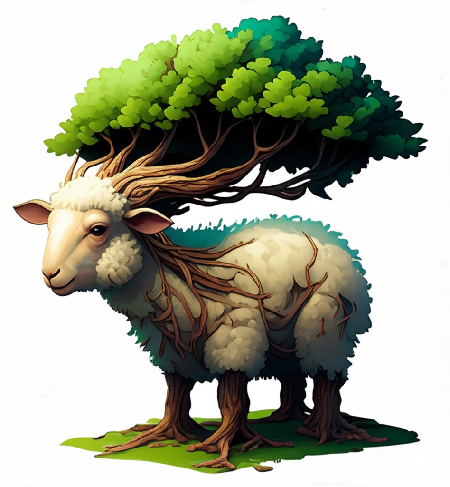
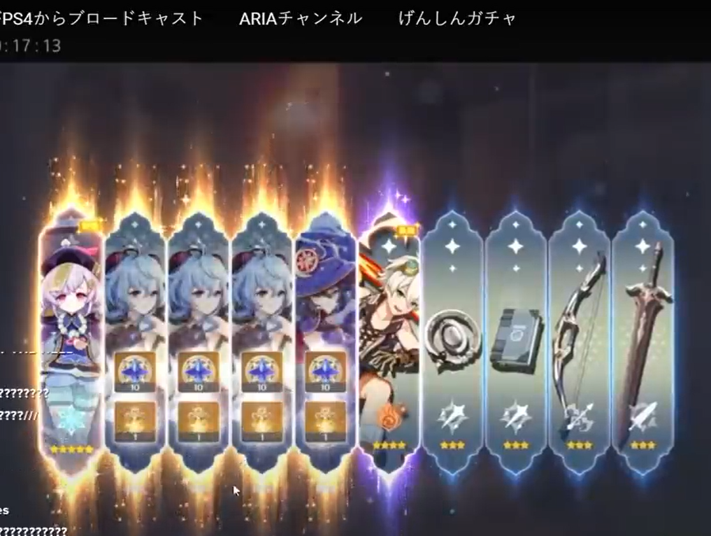
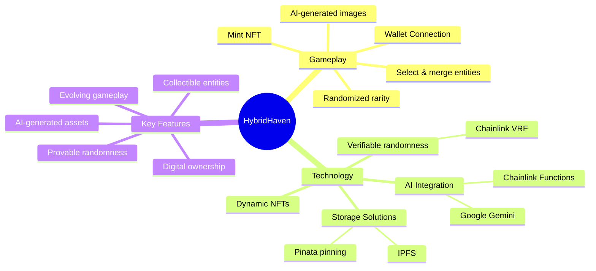
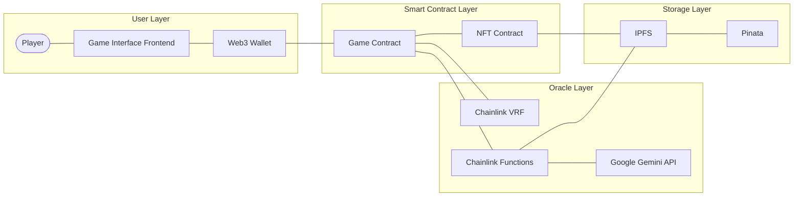
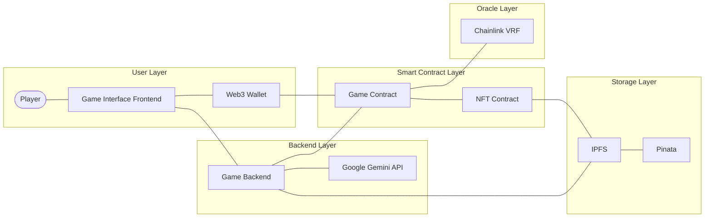
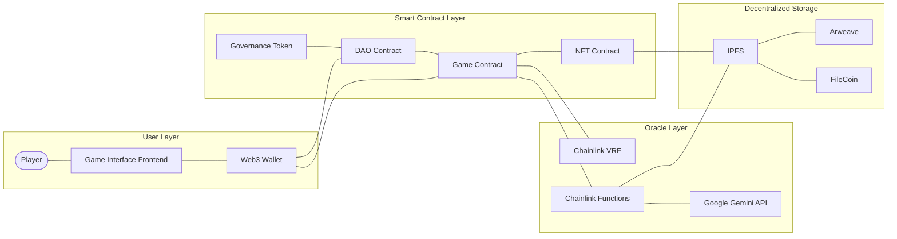
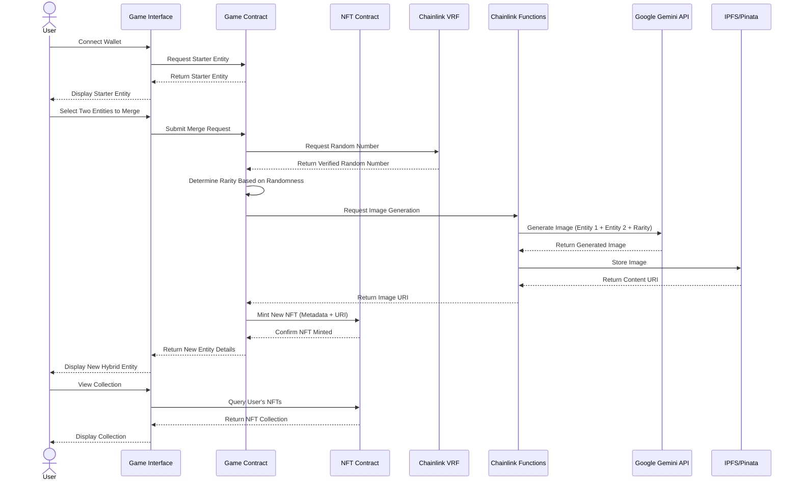

---
# You can also start simply with 'default'
theme: dracula
# some information about your slides (markdown enabled)
title: HybridHaven
info: |
  Discover. Merge. Evolve.
# apply unocss classes to the current slide
# class: text-center
# https://sli.dev/features/drawing
drawings:
  persist: false
# slide transition: https://sli.dev/guide/animations.html#slide-transitions
transition: slide-left
# enable MDC Syntax: https://sli.dev/features/mdc
mdc: true
# open graph
# seoMeta:
#  ogImage: https://cover.sli.dev
---

# HybridHaven

select, merge, and hope that luck is on your side.

 

Harun (23/514148/TK/56466)

Claude 3.7 Sonnet Thinking (copilot)

---
transition: slide-up
level: 2
---

# executive summary

an NFT game with flows:

1. connect wallet
2. given starter entity
3. select 2 entities
4. merge
    - randomized rarity
    - generate the image with AI using 2 entities + rarity
    - mint NFT
5. repeat

---
transition: slide-up
level: 2
---

tree + sheep with 1 star rarity (attribution: Google's Gemini AI)

---
transition: slide-up
level: 2
---

# background

1. use of NFTs
2. implementation of randomness in blockchain
3. AI-generated images (simple and easy assets)
4. it is a game

---
transition: slide-up
level: 2
---

# market opportunity

- web3 gaming market: $37.55B (https://www.precedenceresearch.com/web3-gaming-market) 
- NFT gaming segment: $0.54T (https://www.mordorintelligence.com/industry-reports/global-nft-gaming-market)
- AI-generated content: $2.3B (https://www.custommarketinsights.com/report/ai-powered-content-creation-market)

---
transition: slide-up
level: 2
---

# the problem

1. how to implement verifiable randomness?
2. how to fetch AI-generated images?
3. how to store the images?

---
transition: slide-up
level: 2
---

# frustrating (for me) randomness (off-topic)

$$
\text{five times 5* chance sequentially} \rightarrow 0.006^5 = 7.776 \times 10^{-11}
$$

---
transition: slide-up
level: 2
---

# randomness: the use of Chainlink's VRF oracle

- provably random, tamper-proof, and low cost randomness for smart contracts ([Chainlink VRF](https://chain.link/vrf))
- easy to integrate in smart contracts

 

note: VRF is Verifiable Random Function

---
transition: slide-up
level: 2
---

# images: Google's Gemini + Chainlink's Functions

- easy google api integration and has vast documentation
- easy to integrate in smart contracts

 

note: Chainlink Function is a decentralized compute runtime connecting data, devices, and systems to blockchains with fetch-compute-return scheme (https://chain.link/functions)

---
transition: slide-up
level: 2
---

# storing: IPFS + Pinata pinning service

- easy to integrate and has vast documentation

 

note: 
- IPFS is InterPlanetary File System, a peer-to-peer hypermedia protocol designed to make the web faster, safer, and more open (https://ipfs.io/)
- Pinata is a pinning service for IPFS, which allows you to store and manage your files on IPFS easily (https://pinata.cloud/)

---
transition: slide-up
level: 2
layout: quote
---

# disclaimer

all graph below generated with mermaid + AI for the syntax under supervision

---
transition: slide-up
level: 2
---

# so i proposed:

---
transition: slide-up
level: 2
---

# the architecture:

---
transition: slide-up
level: 2
---

# alt: direct approach from backend

---
transition: slide-up
level: 2
---

# alt: DAO governance

---
layout: quote
transition: slide-left
level: 2
---

# Sequence Diagram

*mermaid + AI generated*

---
transition: slide-up
level: 2
---

---
transition: slide-up
level: 2
---

# tech stack

- frontend: Next.js + TypeScript + Tailwind CSS
- backend: Next.js + ethers.js + hardhat
- smart contract: Solidity on Ethereum
- oracle: Chainlink VRF + Chainlink Functions
- storage: IPFS + Pinata pinning service

---
layout: quote
transition: slide-left
level: 2
---

  <h1 class="text-4xl font-bold">thank you!</h1>

  <a href="https://linkedin.com/in/runs664" target="_blank" class="flex items-center text-blue-400 hover:text-blue-300 transition-colors">
    LinkedIn
  </a>
  <a href="https://github.com/runsdev/web3-project" target="_blank" class="flex items-center text-gray-400 hover:text-gray-300 transition-colors">
    GitHub
  </a>

