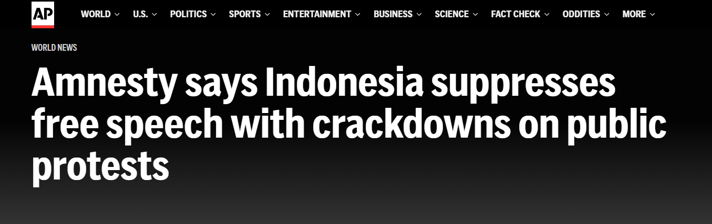
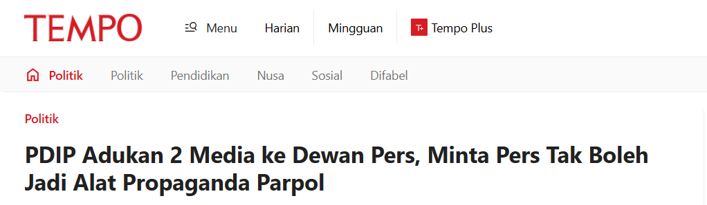
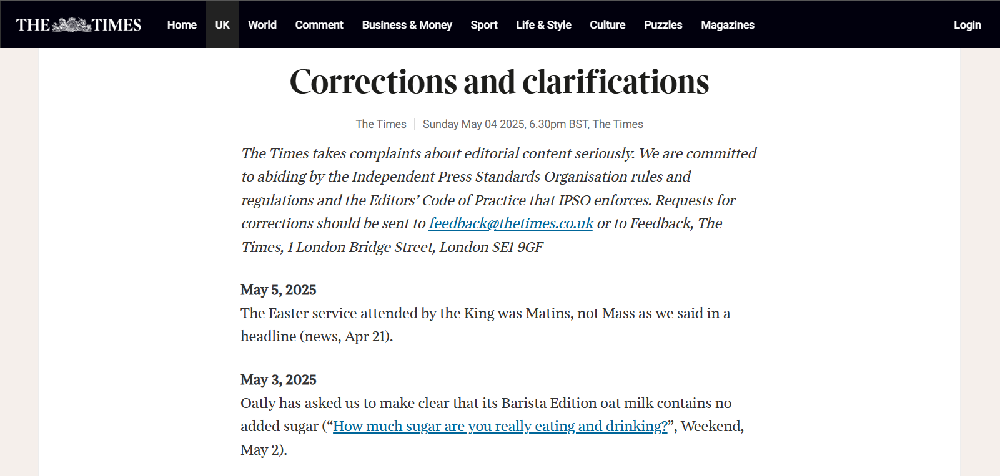
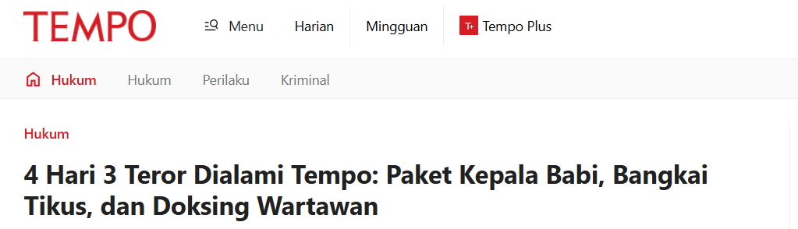
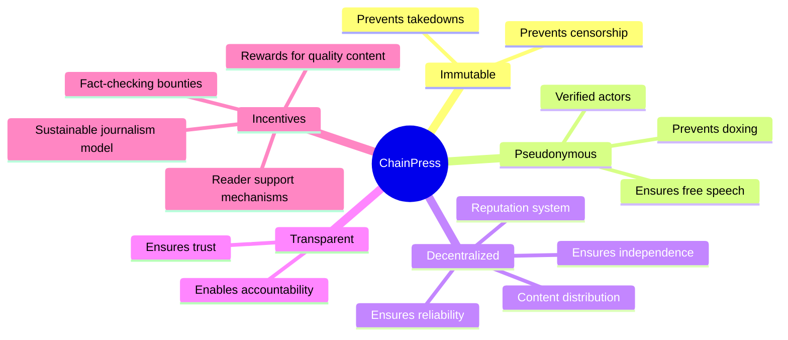
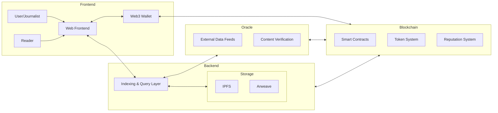

---
# You can also start simply with 'default'
theme: dracula
# some information about your slides (markdown enabled)
title: ChainPress
info: |
  A decentralized content publishing platform for Web3
# apply unocss classes to the current slide
# class: text-center
# https://sli.dev/features/drawing
drawings:
  persist: false
# slide transition: https://sli.dev/guide/animations.html#slide-transitions
transition: slide-left
# enable MDC Syntax: https://sli.dev/features/mdc
mdc: true
# open graph
# seoMeta:
#  ogImage: https://cover.sli.dev
---

# ChainPress

a **censorship-resistant**, **verifiable** journalism platform.
<!--
The last comment block of each slide will be treated as slide notes. It will be visible and editable in Presenter Mode along with the slide. [Read more in the docs](https://sli.dev/guide/syntax.html#notes)
-->

---
layout: two-cols-header
layoutClass: gap-16
---

# dream about free speech, reliability, and independence

::left::

::right::

<!--
Here is another comment.
-->

---
transition: slide-up
level: 2
---

# so i proposed:

---
transition: slide-up
level: 2
---

# with business cases:

1. public permissionless blockchain
2. decentralized storage
3. enable organization
4. enable anonymous whistleblowing

---

# the architecture:

