```mermaid {theme: 'dark', scale: 0.35}
sequenceDiagram
  actor User
  participant Game as Game Contract
  participant VRF as Chainlink VRF
  participant AI as AI Service
  participant IPFS as IPFS Storage
  participant NFT as NFT Contract
  
  %% The architectural difference
  participant CF as "Chainlink Functions (❌ Proposed)"
  participant API as "Backend API (✅ Implemented)"
  
  Note over User,NFT: Proposal vs Implementation Diff Comparison
  
  %% Common initial flow
  User->>Game: Request Merge
  Game->>VRF: Get Randomness
  VRF-->>Game: Return Random
  
  %% Key difference highlighted
  rect rgba(255, 200, 200, 0.3)
  Note over Game,CF: ❌ PROPOSED FLOW (Not Implemented)
  Game->>CF: Request Generation
  CF->>AI: Generate Image
  AI-->>CF: Return Image
  CF->>IPFS: Store Metadata
  IPFS-->>CF: Return Hash
  CF-->>Game: Return URI
  end
  
  rect rgba(200, 255, 200, 0.3)
  Note over Game,API: ✅ IMPLEMENTED FLOW
  Game->>API: Trigger Generation
  API->>AI: Generate Image
  AI-->>API: Return Image
  API->>IPFS: Store Metadata
  IPFS-->>API: Return Hash
  API-->>Game: Return Metadata
  end
  
  %% Common ending
  Game->>NFT: Mint NFT
  NFT-->>User: NFT Minted
```

<br>
<br>
<br>
<br>
<br>
<br>
<br>
<br>
<br>

<div class="pt-4">
  <span class="px-3 py-1 cyber-card text-cyan-400 font-mono neon-text animate-float text-xs">
    Harun (23/514148/TK/56466)
  </span>
</div>

<div class="abs-br m-3 flex gap-1">
  <a href="https://github.com/runsdev/hybridhaven" target="_blank" alt="GitHub" title="Open in GitHub"
    class="text-sm cyber-card p-1 text-cyan-400 hover:text-pink-400 transition-all duration-300 hover:shadow-[0_0_20px_rgba(255,0,128,0.5)]">
    <carbon-logo-github />
  </a>
</div>

---

# System Overview

<div class="grid grid-cols-2 gap-4">

<div class="cyber-card p-4 animate-float text-xs">

## Platform Details
- **Live URL**: https://hybridhaven.runs.my.id
- **Network**: Ethereum Sepolia Testnet
- **RPC**: Google Cloud RPC

## Core Features
- Expandable entity collection
- OpenSea compatible NFTs
- AI-powered hybrid creature generation
- Verifiable random rarity system
- IPFS decentralized storage
- Web3 wallet integration

</div>

<div class="text-center">
  <div class="cyber-card p-3 animate-float" style="animation-delay: 0.5s;">
    <div class="text-pink-400 mb-1 font-mono text-xs animate-cyber-pulse">[GAME_PORTAL]</div>
    <QR value="https://hybridhaven.runs.my.id" size="200" render-as="svg" class="m-auto"/>
    <div class="mt-1 text-cyan-400 font-mono text-xs">Scan to access the game</div>
  </div>
</div>

</div>

---

# Implementation vs Proposal

<div class="grid grid-cols-2 gap-4">

<div class="cyber-card p-3 text-xs">

### ✅ Successfully Implemented

| Feature | Status | Notes |
|---------|--------|-------|
| Fullstack Web3 App | <span class="text-green-400 animate-cyber-pulse text-xs">✅ Complete</span> | Next.js + Tailwind CSS |
| NFT Merging | <span class="text-green-400 animate-cyber-pulse text-xs">✅ Complete</span> |  |
| Chainlink VRF | <span class="text-green-400 animate-cyber-pulse text-xs">✅ Complete</span> | v2.5 Integration |
| AI Integration | <span class="text-green-400 animate-cyber-pulse text-xs">✅ Complete</span> | Google Gemini |
| IPFS Storage | <span class="text-green-400 animate-cyber-pulse text-xs">✅ Complete</span> | Pinata Service |
| Web3 Wallet | <span class="text-green-400 animate-cyber-pulse text-xs">✅ Complete</span> | MetaMask/ETH Supported |
| OpenSea Compatibility | <span class="text-green-400 animate-cyber-pulse text-xs">✅ Complete</span> | ERC-721 Standard |

</div>

<div class="cyber-card p-3 text-xs">

### 🔄 Architecture Changes

| Component | Proposed | Implemented | Reason |
|-----------|----------|-------------|---------|
| AI Integration | Chainlink Functions | Direct Backend API | Better reliability, predictable costs |

<!-- <div class="cyber-card p-2 mt-2 border-green-400/50">
<span class="text-green-400 font-mono neon-text animate-cyber-pulse text-xs">COMPLETION_RATE: 100%</span>
</div> -->

</div>

</div>

---

# System Architecture

<div class="cyber-card p-4">


<div class="text-center mt-2 cyber-card p-2 inline-block">
<span class="neon-text font-mono text-xs animate-cyber-pulse">
<strong>COMPONENTS</strong> : (2 + 1) Smart Contracts + 1 Fullstack App • 2 External Services
</span>
</div>

</div>

---

# Smart Contract Analysis


<div class="cyber-card p-4 text-xs">

### Contract Deployment Details

| Contract | Address | Function | Verified (Etherscan) |
|----------|---------|----------| ---------------------|
| GameContract | `0x3b20dB5784862D3a615e089923b6aD1d6e65A28f` | Core game logic | ✅ |
| NFTContract | `0x906834aeC6B6F486F306D66DEDd5925B30cfEB3c` | ERC-721 OpenSea Compatible tokens | ✅ |
| VRFConsumer | `0x48796e7CFdf0ad487875891ad651c7d9562dBa43` | Verifiable randomness oracle | ✅ |

</div>

---


# Game Mechanics Flow

<div class="cyber-card p-3 text-xs">


</div>

---


<div class="grid grid-cols-1 gap-4">

<div class="cyber-card p-3 text-xs m-auto">



</div>


</div>

---

# Performance and Cost Analysis
<div class="grid grid-cols-2 gap-4">

<div class="cyber-card p-3 text-xs">

| Metric | Target | Achieved | Status |
|--------|--------|----------|--------|
| Merge Process | <120s | 70-80s | <span class="text-green-400 animate-cyber-pulse text-xs">✅</span> |
| Platform Uptime | >95% | 100% | <span class="text-green-400 animate-cyber-pulse text-xs">✅</span> |


</div>

<div class="cyber-card p-3 text-xs">

| Component | Cost per Operation | Payer |
|-----------|-------------------|-------|
| Merge Game Cost | 0.0001 ETH | Player |
| Merge + Mint Gasses | ~0.0006 ETH | Player |
| VRF Request | ~0.00002 ETH | Game Contract |
| AI Generation | 0.00 ETH | Game Contract |
| IPFS Storage | 0.00 ETH | Game Contract |
| ----------- | ----------------- | ------- |
| **Total per Merge** | **~0.0007 ETH** | Player |
| **Total per Merge** | **~0.00002 ETH** | Game Contract |
| **Game Profit** | **~0.00008 ETH** |

</div>

</div>

---

# Security Measures

<div class="grid grid-cols-2 gap-4">

<div class="cyber-card p-3 text-xs">

```solidity
function requestRandomWords(
  bool enableNativePayment
) external returns (uint256 requestId) {
  requestId = s_vrfCoordinator.requestRandomWords(
    ...
  )
  ...
}
```

Possible reentrancy in `ChainlinkVRFConsumer.requestRandomWords(bool)`
ChainlinkVRFConsumer.sol: Exploitable from `ChainlinkVRFConsumer.requestRandomWords(bool)`
GameContract.sol: Exploitable from `GameContract.requestMerge`

`(string,string,bool,bool,uint256,uint256)`

</div>

<div class="cyber-card p-3 text-xs">

```solidity
import "@openzeppelin/contracts/security/
        ReentrancyGuard.sol";
...
contract ChainlinkVRFConsumer is 
         VRFConsumerBaseV2Plus, 
         ReentrancyGuard {
  ...
  function requestRandomWords(
    bool enableNativePayment
  ) external nonReentrant returns (uint256 requestId) {
    requestId = s_vrfCoordinator.requestRandomWords(
      ...
    )
    ...
  }
  ...
}
```

</div>

</div>

---

<div class="text-center space-y-4 relative">
  <!-- <div class="absolute inset-0 bg-gradient-to-r from-pink-500/10 via-cyan-500/10 to-purple-500/10 rounded-3xl animate-cyber-pulse"></div> -->
  
  <div class="relative z-10">
    <h1 class="text-3xl font-bold neon-text animate-float mb-2">
      Thank You~
    </h1>
    
  <div class="max-w-2xl mx-auto mt-4">
    
  <div class="cyber-card px-4 border-green-400/30 animate-float text-left">
    <div class="space-y-3">
      <div class="border-l-2 border-green-400/50 pl-2">
      <p class="text-pink-400 text-xs font-mono">Q: Is this more than "OpenSea"?</p>
      <p class="text-green-400 text-xs font-mono">A: No, it is an OpenSea-Compatible NFT game.</p>
      </div>
      <div class="border-l-2 border-green-400/50 pl-2">
      <p class="text-pink-400 text-xs font-mono">Q: Who are the actors in the system?</p>
      <p class="text-green-400 text-xs font-mono">A: Users (players) and oracles (Chainlink VRF).</p>
      </div>
      <div class="border-l-2 border-green-400/50 pl-2">
      <p class="text-pink-400 text-xs font-mono">Q: Who pays for the oracle? then pays the owner?</p>
      <p class="text-green-400 text-xs font-mono">A: The contract owner covers oracle fees. Player pays per merge.</p>
      </div>
      <div class="border-l-2 border-green-400/50 pl-2">
      <p class="text-pink-400 text-xs font-mono">Q: What's the incentive for creators?</p>
      <p class="text-green-400 text-xs font-mono">A: System uses person-less creation with AI, no traditional creator incentives needed.</p>
      </div>
    </div>
  </div>

  <div class="flex justify-center space-x-4 pt-6">
    <a href="https://hybridhaven.runs.my.id" target="_blank" 
        class="bg-gradient-to-r from-blue-600 via-purple-600 to-indigo-600 hover:from-blue-500 hover:via-purple-500 hover:to-indigo-500 text-white font-bold py-2 px-4 text-xs rounded-2xl transition-all duration-300 transform hover:scale-105 shadow-2xl shadow-blue-500/25 border border-blue-400/30 hover:border-blue-300/50 flex items-center justify-center space-x-3">
      🎮 Try the Game
    </a>
    <a href="https://github.com/runsdev/hybridhaven" target="_blank" 
        class="cyber-card hover:border-cyan-400 text-cyan-400 hover:text-pink-400 
              font-bold py-2 px-4 text-xs transition-all duration-300 animate-float" style="animation-delay: 0.2s;">
      📂 View Source Code
    </a>
    <a
      href="https://testnets.opensea.io/collection/hybridhaven"
      target="_blank"
      rel="noopener noreferrer"
      className="bg-gradient-to-r from-blue-600 via-purple-600 to-indigo-600 hover:from-blue-500 hover:via-purple-500 hover:to-indigo-500 text-white font-bold py-2 px-4 text-xs rounded-2xl transition-all duration-300 transform hover:scale-105 shadow-2xl shadow-blue-500/25 border border-blue-400/30 hover:border-blue-300/50 flex items-center justify-center space-x-3"
    >
      <span className="text-xs">🌊</span>
      View on OpenSea
    </a>
  </div>

  <!-- <div class="cyber-card p-3 mt-4 text-xs text-cyan-400 font-mono inline-block">
    <p>Harun (23/514148/TK/56466)</p>
    <p>Blockchain and DLTs</p>
  </div> -->
      
  </div>
  </div>
</div>

